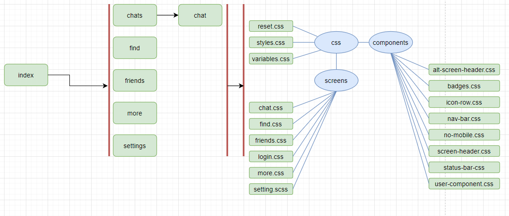

# Kakao Talk Clone

## Overview
I cloned Kakao Talk UI to practice HTML, CSS for mobile page. Profile page, chat page and the other pages are implemented. The advanced CSS skills such as flex-box, media, and animation.

## Technology Stack
* **Front-End**: HTML5, CSS3
* Workflow
 
 *[Workflow]*
## Results
The [DEMO](https://04wakeup.github.io/kokoa_clone/) site is available on small size environment like mobile. This chat application's UI pages are cloned. The components for CSS are implemented to reuse on proper pages. I learned UI creation tips and tricks that will be helpful for future endeavors and projects.

## Features
* **Loding page**
* **Friends list page**
* **Chat page**
* **Find page**
* **More page**
  
>Reference: [NOMAD CODERS](https://en.nomadcoders.co/kokoa-clone)